# BuddyBot

<div align="center">


<br>

<b>AI를 활용한 ROS 2 기반 실내 자율주행·상호작용 로봇</b><br>
Raspberry Pi 5의 인지·계획과 Raspberry Pi Pico의 모터·안전 제어를 분리한<br>
<b>Brain–Spinal 분산 제어 아키텍처</b>

<br>
<br>

[](#전체-아키텍처)
[](#하드웨어-통합)
[](#하드웨어-통합)
[](#ai-활용-범위)
[](#저장소-구성)
[](#동작-데모)

</div>

<br>

<table>
  <tr>
    <td width="42%" align="center">
      
    </td>
    <td width="58%">
      <h3>Project Snapshot</h3>
      <p><b>개발 기간</b><br>2025.03 – 2026.06</p>
      <p><b>팀 구성</b><br>3명</p>
      <p><b>담당 역할</b><br>팀장 · 전체 시스템 아키텍처 설계 및 통합</p>
      <p><b>최종 결과</b><br>체크포인트 자율이동·장애물 회피, 사용자 추종, 음성·수동 제어, 서버 AI 질의응답, LiDAR 미니맵, 소프트웨어 비상정지 실물 검증</p>
    </td>
  </tr>
</table>

---

## 목차

- [프로젝트 소개](#프로젝트-소개)
- [동작 데모](#동작-데모)
- [핵심 기능](#핵심-기능)
- [전체 아키텍처](#전체-아키텍처)
- [주요 설계 결정](#주요-설계-결정)
- [시스템 통합 화면](#시스템-통합-화면)
- [하드웨어 통합](#하드웨어-통합)
- [개발 및 검증 과정](#개발-및-검증-과정)
- [담당 역할](#담당-역할)
- [저장소 구성과 실행 문서](#저장소-구성)
- [한계와 다음 개선](#한계와-다음-개선)

## 프로젝트 소개

BuddyBot은 카메라·마이크 입력, AI 객체·사람 인식, 음성 인터페이스와 ROS 2 자율주행을 결합해 실내에서 사람과 상호작용하며 이동하는 3륜 옴니휠 로봇입니다.
상위 Raspberry Pi 5는 ROS 2 기반의 센서 처리·인지·경로 계획·명령 중재를 담당하고, 하위 Raspberry Pi Pico는 50 Hz 모터 제어 루프와 watchdog 기반 fail-safe를 담당합니다.

이 프로젝트의 핵심은 기능을 단순히 한 보드에 연결한 것이 아니라, **변동성이 큰 Linux/AI 계층과 결정론적 모터·안전 계층의 책임을 분리**하고 여러 제어 입력이 충돌하지 않도록 하나의 최종 명령 경로로 통합한 것입니다.

> 서버컴 모드의 `BuddyBot-ai`는 음성 인식·통합 GUI를 통해 전진·정지·추종·체크포인트 이동 같은 **고수준 동작을 요청**할 수 있습니다. 다만 서버의 LLM이나 웹앱이 모터 PWM을 직접 생성하는 구조는 아닙니다. Pi 5가 요청을 ROS 2 제어 명령으로 판별·변환하고 `command_mux_node`가 최종 명령을 선택한 뒤, Pico가 운동학·PID·PWM과 watchdog 안전 제어를 수행합니다.

### AI 활용 범위

| 영역 | AI 활용 방식 | 제어 연결 방식 |
| --- | --- | --- |
| 객체·사람 인식 | 카메라 영상에서 객체와 사용자를 검출해 추종 입력 생성 | 검출 결과를 `follow_controller`가 ROS 2 속도 명령으로 변환 |
| 음성 인식 | 내장 마이크의 음성을 서버컴 또는 Pi 5의 STT 경로가 “전진”, “멈춰”, “따라와”, 목적지 명령 등의 텍스트로 변환 | Pi 5가 인식 문장을 로컬 allowlist로 분류해 수동 주행·추종·내비게이션 ROS 2 명령으로 변환 |
| 서버컴 통합 제어 | `BuddyBot-ai`의 음성 인터페이스·웹 GUI에서 수동 이동, 추종 시작·중지, 체크포인트 이동 요청 | 서버는 고수준 명령을 전달하고 Pi 5의 제어 노드와 command mux가 실제 실행 경로를 결정 |
| 질의응답·음성 출력 | 서버 PC의 `BuddyBot-ai`가 간단한 질문에 답하고 STT/TTS를 제공 | LLM 대화 응답과 모터의 저수준 제어를 분리 |
| 자율주행·안전 | ROS 2 내비게이션, LiDAR 회피, command mux와 Pico watchdog 사용 | AI 판단과 분리된 결정론적 제어 경로 유지 |

## 동작 데모

### 체크포인트 자율이동 및 LiDAR 장애물 회피

<p align="center">
  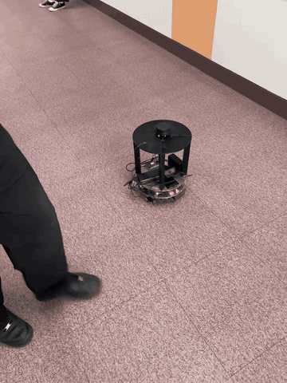
</p>

저장된 체크포인트로 이동하는 동안 LiDAR 스캔을 이용해 진행 방향의 장애물을 감지하고 회피 명령을 우선 적용했습니다.

### 사용자 추종 — 인식 화면과 실물 주행

| 추종 인식·제어 화면 | 실물 사용자 추종 |
| --- | --- |
| 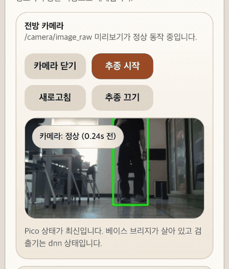 | <a href="docs/assets/portfolio/person-follow-physical.mp4">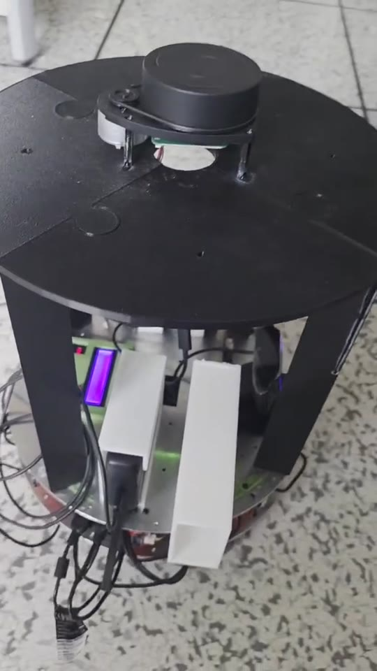</a> |
| 카메라 영상에서 사람을 검출하고 추종 상태, Pico·bridge 상태를 패널에서 함께 확인 | 초기 락온 구간을 덜어낸 실물 추종 영상. 이미지를 누르면 전체 동작이 열립니다. |

왼쪽은 **사용자 검출과 추종 제어가 활성화된 상태**, 오른쪽은 **촬영자가 물러날 때 로봇이 사용자 방향으로 이동하는 실물 결과**를 보여줍니다. 두 기록을 함께 배치해 인식 화면과 실제 구동을 교차 검증했습니다.

### 음성 명령 주행

<p align="center">
  <a href="docs/assets/portfolio/voice-command.mp4">
    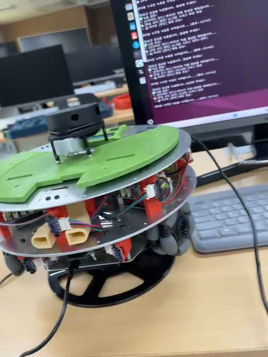
  </a>
  <br>
  <sub>이미지를 누르면 소리가 포함된 전체 영상이 열립니다.</sub>
</p>

서버컴 또는 Pi 5의 STT가 호출어와 전진 음성을 텍스트로 변환하면, Pi 5가 로봇 명령을 로컬에서 판별해 ROS 2 속도 명령으로 변환하고 Pi 5–Pico 제어 경로를 거쳐 실제 모터를 구동했습니다.

### 서버 AI 질의응답 — 날씨

<p align="center">
  <a href="docs/assets/portfolio/weather-assistant.mp4">
    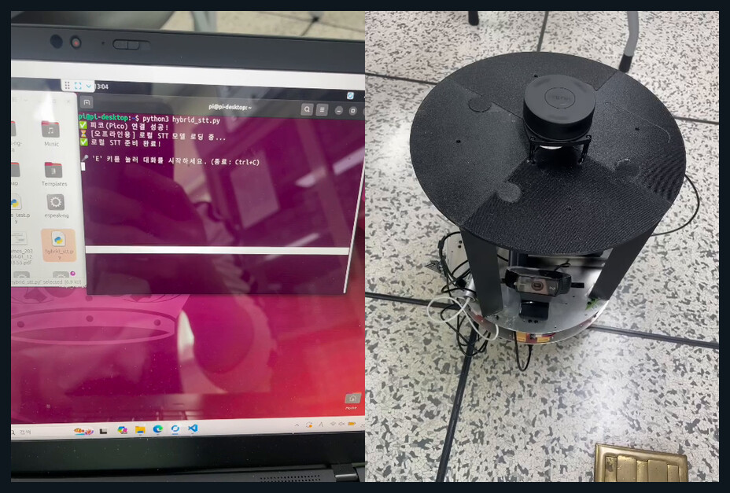
  </a>
  <br>
  <sub>이미지를 누르면 질문과 음성 응답이 포함된 전체 영상이 열립니다.</sub>
</p>

웹캠의 내장 마이크로 질문을 입력하고, 서버 PC의 `BuddyBot-ai`가 질의를 처리해 음성으로 응답하는 상호작용 경로를 검증했습니다.

## 핵심 기능

| 기능 | 구현 내용 | 실물 검증 |
| --- | --- | :---: |
| 체크포인트 이동 | 저장된 목적지 선택 및 자율 이동 | ✅ |
| 장애물 회피 | LiDAR 방향별 거리 분석 후 회피·정지 명령 생성 | ✅ |
| 사용자 추종 | 카메라 기반 사람 검출 결과로 추종 속도 생성 | ✅ |
| 수동 주행 | 웹·모바일 패널에서 전후·좌우·회전 제어 | ✅ |
| 음성 명령 | 웨이크워드 후 이동·정지·추종·목적지 명령 처리 | ✅ |
| 서버 AI 질의응답 | 내장 마이크 입력과 `BuddyBot-ai`의 질의 처리·음성 응답 | ✅ |
| LiDAR 미니맵 | 실시간 스캔과 체크포인트를 패널에 시각화 | ✅ |
| 소프트웨어 비상정지 | 모든 동작 소스를 해제하고 정지 명령을 최우선 적용 | ✅ |

## 전체 아키텍처

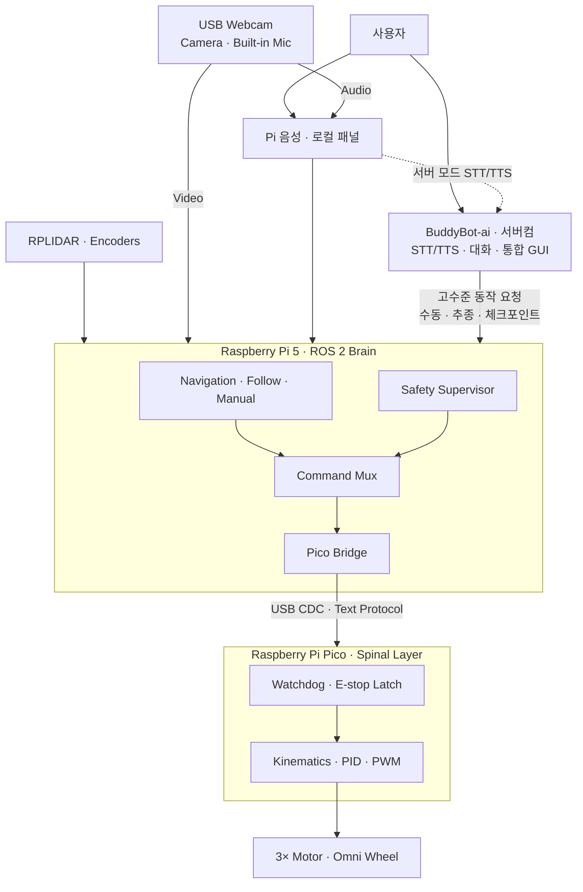

### 계층별 책임

| 계층 | 책임 |
| --- | --- |
| Raspberry Pi 5 | ROS 2 노드 오케스트레이션, LiDAR와 카메라·마이크 입력 처리, 추종·내비게이션, 명령 중재, 상태 패널 |
| Raspberry Pi Pico | 옴니휠 운동학, 엔코더 피드백, PID/PWM 모터 제어, watchdog 및 정지 래치 |
| BuddyBot-ai | 선택적 대화·STT·TTS·통합 GUI 및 고수준 로봇 명령 요청. 저수준 모터 제어는 Pi 5–Pico 경로에 위임 |

## 주요 설계 결정

### 1. Brain–Spinal 책임 분리

Linux 기반 Pi 5는 센서와 AI 처리를 유연하게 확장할 수 있지만 프로세스 지연이나 장애 가능성이 있습니다. 모터 출력과 통신 단절 감지는 Pico에 분리해 상위 계층 이상 시에도 하위 계층이 정지 상태로 전환하도록 구성했습니다.

### 2. 단일 최종 명령 경로

추종, 내비게이션, 수동 조작, 장애물 회피가 각각 속도 명령을 만들지만 모터로 직접 전달하지 않습니다. `command_mux_node`가 아래 우선순위로 한 소스만 선택하고 `/cmd_vel_final`을 발행합니다.

```text
E-STOP > Safety Override > Manual > Navigation > Follow > Idle
```

명령이 갱신되지 않으면 Pi 5의 command timeout이 오래된 명령을 폐기하고, Pi 5–Pico heartbeat가 끊기면 Pico watchdog이 모터를 정지합니다.

### 3. 디버깅 가능한 Pi 5–Pico 프로토콜

실물에서 검증된 USB CDC 연결과 사람이 읽을 수 있는 line-based text protocol을 사용했습니다.

```text
Pi 5 → Pico : HB | CMD,vx,vy,wz | BRAKE | CLEAR
Pico → Pi 5 : ACK,* | STAT,* | RPM,* | SAFE,*
```

잘못된 패킷은 무시하고, 속도 값은 허용 범위로 제한하며, 연결이 복구되면 bridge가 자동 재연결합니다.

### 4. 서버컴의 고수준 명령과 저수준 모터 제어의 분리

[BuddyBot-ai](https://github.com/rasasoe/BuddyBot-ai)는 일반 대화와 STT/TTS뿐 아니라 서버 GUI·음성을 통한 수동 이동, 추종 시작·중지, 체크포인트 이동 같은 고수준 요청을 제공합니다. 음성 명령은 서버컴이 텍스트로 변환하더라도 Pi 5에서 allowlist 기반 로봇 명령으로 판별하며, 서버가 보낸 동작 요청 역시 Pi 5의 ROS 2 제어 노드와 command mux를 거쳐 실행됩니다. 서버의 LLM·웹앱은 Pico의 운동학·PID·PWM에 직접 접근하지 않으며, 서버가 없어도 로컬 패널과 기본 제어 경로를 사용할 수 있도록 분리했습니다.

## 시스템 통합 화면

<p align="center">
  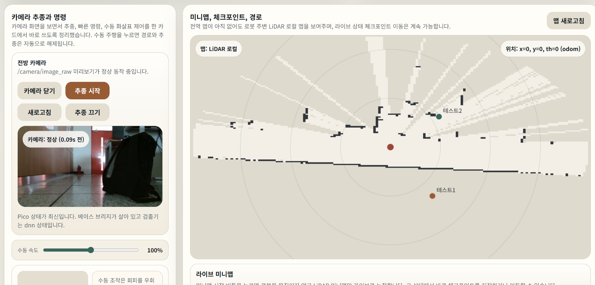
</p>

패널에서 카메라 상태, 사람 추종, LiDAR 로컬 미니맵, 체크포인트, 수동 주행 및 안전 상태를 한 화면에서 확인하도록 통합했습니다.

## 하드웨어 통합

| Raspberry Pi 5 · 상위 제어 계층 | Raspberry Pi Pico · 모터 제어 계층 |
| --- | --- |
| 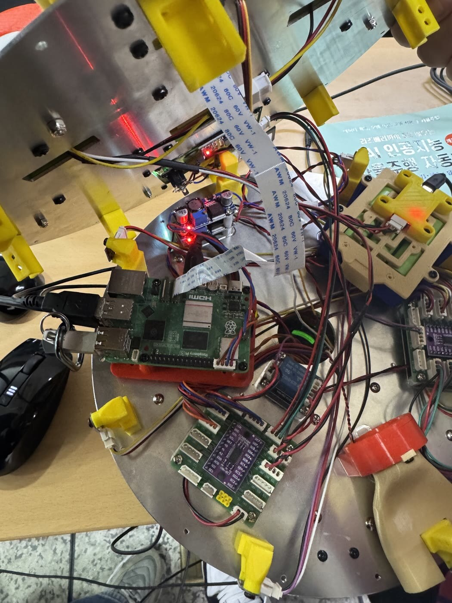 | 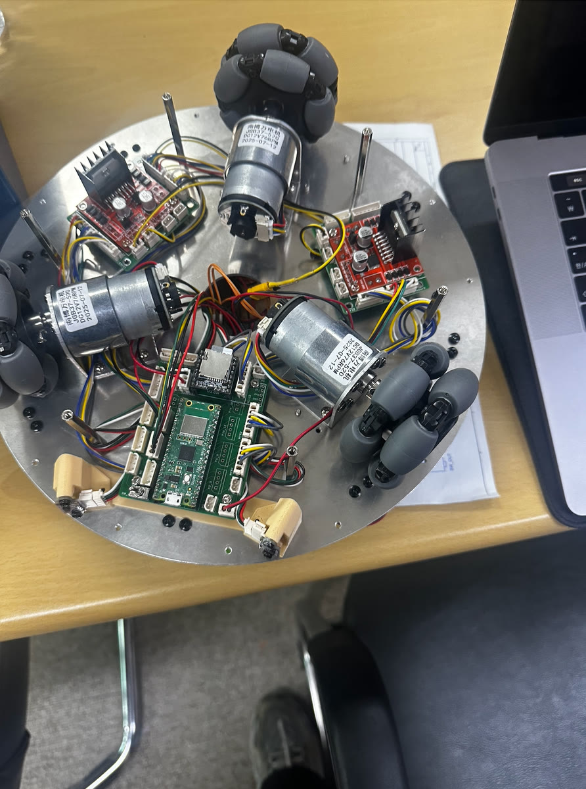 |
| ROS 2, LiDAR, 카메라·마이크, 상위 의사결정 | 3륜 옴니 구동, 엔코더, PID/PWM, watchdog |

### 주요 구성

- Raspberry Pi 5
- Raspberry Pi Pico (RP2040)
- RPLIDAR A1M8
- Logitech C920e USB 웹캠 — 객체·사람 인식용 카메라와 웨이크워드·음성 명령·AI 질의 입력용 내장 마이크
- VL53L0X ToF 센서와 I2C multiplexer
- 3륜 옴니휠, DC 기어드 모터와 엔코더
- 모터 드라이버 및 전원 계통

## 개발 및 검증 과정

<p align="center">
  
</p>

1. Gazebo/RViz에서 로봇 모델과 센서·SLAM 흐름 검증
2. Pico 단독 모터·엔코더·운동학 테스트
3. Pi 5–Pico USB CDC bridge 및 heartbeat 통합
4. 추종·내비게이션·수동 명령을 command mux로 통합
5. LiDAR 장애물 회피와 정지 경로 추가
6. 웹·모바일 패널과 음성 인터페이스 통합
7. 실제 실내 환경에서 전체 기능 검증

<details>
<summary><strong>초기 센서 bring-up 기록 보기</strong></summary>

| LiDAR 스캔 반응 테스트 | 카메라 객체 인식 테스트 |
| --- | --- |
| 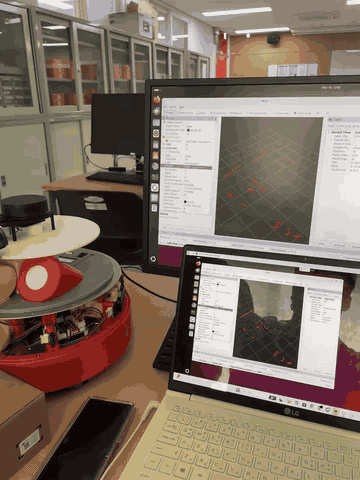 | 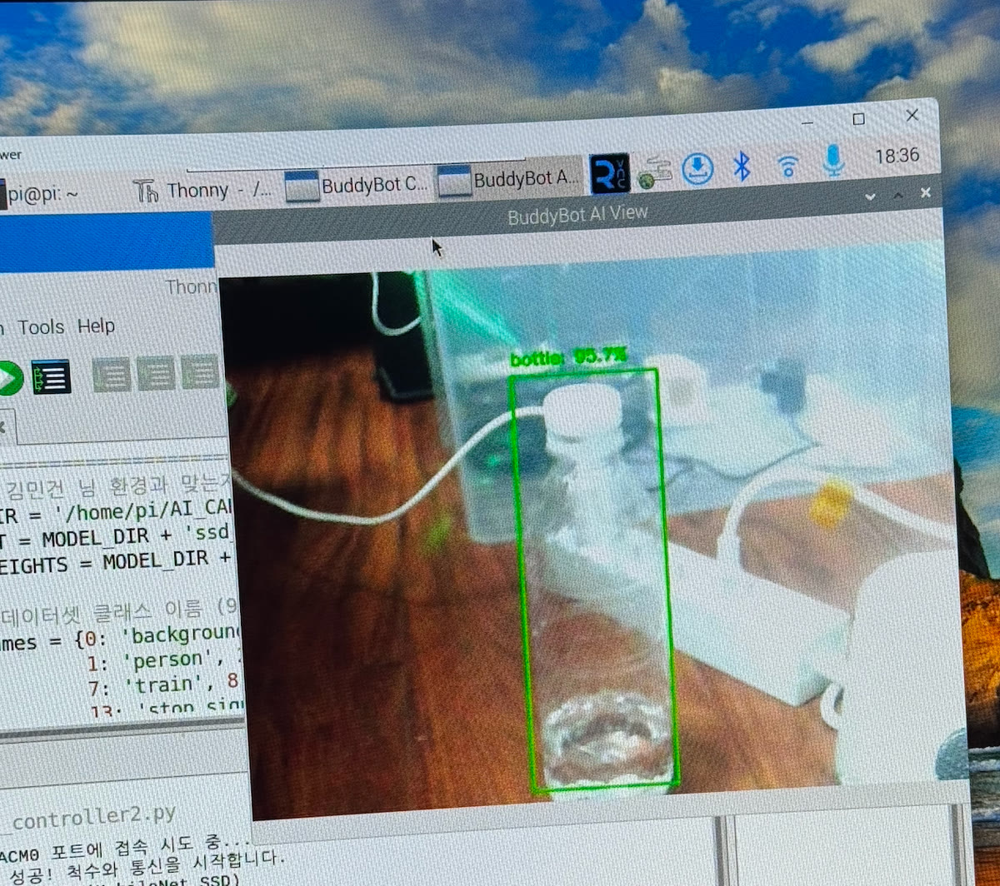 |
| 물체를 센서 주변에서 움직이며 scan point가 갱신되는지 확인 | 카메라 입력과 객체 검출 모델의 실시간 추론 경로 확인 |

초기에는 각 센서의 입력과 시각화부터 독립적으로 검증하고, 이후 ROS 2 노드와 최종 운용 패널로 통합했습니다.

</details>

## 담당 역할

3인 팀의 팀장으로서 전체 시스템 아키텍처 설계와 통합을 담당했습니다.

- Pi 5와 Pico의 책임 경계 및 통신 구조 설계
- ROS 2 노드·토픽과 최종 제어 흐름 통합
- 추종·내비게이션·수동·안전 명령의 우선순위 설계
- LiDAR, 카메라, 모터, 엔코더 등 하드웨어–소프트웨어 통합
- 웹/모바일 패널과 음성 인터페이스의 시스템 연결
- 실물 bring-up, 장애 원인 추적 및 최종 시연 조율

세부 기능 개발은 팀원들과 분담했으며, 이 저장소는 최종 통합된 로봇 측 소프트웨어와 펌웨어를 담고 있습니다.

## 저장소 구성

```text
BuddyBot/
├── firmware/pico_motor_controller/    # Pico 모터·엔코더·안전 펌웨어
├── software/pi5/ros2_ws/src/           # Pi 5 ROS 2 패키지
│   ├── buddybot_base/                  # Pico serial bridge와 odometry
│   ├── buddybot_system/                # command mux, safety, LiDAR avoidance
│   ├── buddybot_nav/                   # waypoint 관리
│   ├── buddybot_vision/                # 사람 검출·추종
│   ├── buddybot_voice/                 # 음성 인터페이스
│   └── buddybot_panel/                 # 웹·모바일 운용 패널
├── scripts/                            # 설치·진단·시연 실행 스크립트
└── docs/                               # 아키텍처·프로토콜·운용 문서
```

## 실행 및 문서

README에는 프로젝트 핵심만 남기고 상세 운용 절차는 문서로 분리했습니다.

- [아키텍처](docs/architecture.md)
- [Pi 5·Pico 설치](docs/TEAM_SETUP_PI5_AND_PICO.md)
- [Bring-up](docs/bringup.md)
- [USB serial protocol](docs/uart_protocol.md)
- [음성 명령](docs/voice_commands.md)
- [핀 매핑](docs/pin_mapping.md)

대표 실행:

```bash
cd ~/BuddyBot
bash scripts/start_presentation_mode.sh mapping
```

> 실제 하드웨어, ROS 2 Jazzy 환경, 장치별 권한과 설정이 필요합니다. 상세 절차는 위 문서를 확인해 주세요.

## 한계와 다음 개선

- 현재 비상정지는 소프트웨어 명령과 Pico watchdog 중심이며, 독립적인 물리 E-STOP 입력은 후속 하드웨어 개선 항목입니다.
- 장애물 회피·추종 성공률과 정지 응답 시간을 표준화된 반복 시험으로 수치화하지 못했습니다.
- 웹 패널 접근 제어, 전송 구간 보호, 설정·비밀정보 분리를 강화할 필요가 있습니다.
- 실물 hardware-in-the-loop 테스트와 CI 자동화를 추가하면 회귀 검증 신뢰도를 높일 수 있습니다.

## Companion Repository

[BuddyBot-ai](https://github.com/rasasoe/BuddyBot-ai)는 서버 PC에서 실행되는 선택적 AI·관제 서비스입니다. 대화와 STT/TTS, 통합 GUI, 수동 이동·추종·체크포인트 이동 같은 고수준 명령 요청을 담당합니다. 요청의 ROS 2 명령 변환·중재와 Pico의 모터·안전 제어는 이 저장소의 Pi 5–Pico 경로가 담당합니다.
